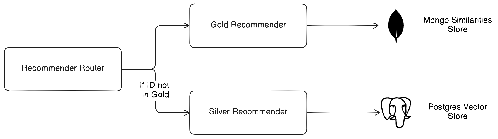
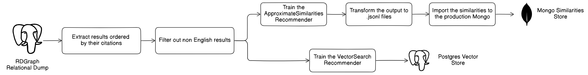

# Similarity Based Recommender

The similarity based recommender, given a research product (eg. publications) will recommend similar research products based on their textual and metadata attributes.

The recommender takes into account the following attributes:

- title (TEXT)
- description (TEXT)
- keywords (TEXT)
- type (METADATA)

## API

The API docs of the recommender can be found:
[https://darelab.athenarc.gr/api/faircore/item-to-item-recommender/docs](https://darelab.athenarc.gr/api/faircore/item-to-item-recommender/docs)

## Architecture and Deployment of the Item-to-Item Recommender (FC4EOSC)

We present the architecture and deployment of the Item-to-Item Recommender for FC4EOSC (but applicable to any future deployments).

### Architecture

The architecture (presented below) is based on two separate recommenders:

**Gold recommender**

The gold recommender applied on a subset of the items. It does not scale well due to the requirement of performing
pairwise similarity computations between the input items.
This requirement exists by the SDR similarity calculation algorithm that cannot be done online but provides better
recommendations.

**Silver recommender**

The silver recommender applied on the rest of the items. It scales well since we do not use the SDR similarity allowing
for online searches on a vector search (`pgvector`).

The flow of requesting a recommendation is presented in the following diagram:



### Deployment

In this section we will focus on the procedure of training the two recommenders above and deploy them on our prod server.
This part should be followed when:

* A new dump arrives for FC4EOSC project
* We want to create an item-to-item recommender for a new project

Prerequisites:

* A running instance of Mongo on the prod server
* A running instance of Postgres on the prod server

For a quick overview of the steps required you can check the following diagram:



**1. Extract results ordered by their citations**

We need to extract the results that we are going to train the recommender on. We also order the results by their
citations in order to train the gold recommender on the most cited items and the silver recommender on the rest.
This is a use case specific for the fc4eosc case. In any other project a ranking method should be defined and applied.

The psql command used for extracting the results into a csv file in `/tmp/results.csv` is:
```sql
\copy
(
    WITH result_citations_numb AS
    (
        SELECT r.id, COUNT(*) AS citations_numb
        FROM result r
            INNER JOIN result_citations rc on r.id = rc.result_id_cited
            GROUP BY r.id
    )

    SELECT r.id, r.title, r.description, r.language, r.type, rcn.citations_numb
    FROM result r INNER JOIN result_citations_numb rcn ON r.id = rcn.id
    WHERE r.description != '' AND r.description IS NOT NULL AND r.title != '' AND r.title is NOT NULL
        AND (r.language = 'eng' OR r.language = 'und') ORDER BY rcn.citations_numb DESC
) To '/tmp/results.csv' With CSV DELIMITER ',' HEADER
```

**2. Filter out non-english results**

In our dataset there are many results that have `language=='und'`. Many of them are in english and we want to keep them
by detecting them. This is done by using the `langdetect` library in python.

The script can be found in `development/faircore_similarity_rs/engilsh_results_filtering.py`.


**3. Split the dataset into gold and silver**

We split the dataset with the first `n` rows being the gold dataset and the rest being the silver dataset.
The `n` is a parameter and depends on the dataset size and the resources available. In our case we had `n = 2M`.

**4. Training of the gold recommender**

The training of the gold recommender can be started by calling the `development/faircore_similarity_rs/offline_initialization_gold.py` script.
Take into account that this is a time consuming process and can take up to days requiring a lot of resources (GPU and RAM especially).
In our case, the gold recommender was trained on a dataset of 2M items and it took around 3 days on the `gpu` server.

The command we executed was:
```bash
nohup python -u development/faircore_similarity_rs/offline_initialization_gold.py -i results.csv -n 2000000 \
  -r faircore -b 128 -p 5 -o gold_items.out -o gold.out > gold_items_train.txt &
```

where:

* `-i` is the path to the file with all the results
* `-n` is the number of items to train on (first n items)
* `-r` is the name of the recommender
* `-b` is the batch size
* `-p` is the number of processes to use
* `-o` is the output file

We are using `nohup` to run the process in the background and `&` to detach the process from the terminal.

**5. Transform the output to .jsonl**

The output of the above script (`gold.out`) is a binary file. We need to transform it to a `.jsonl` file in order to be able to
import it to our mongo. This is done via the script `development/faircore_similarity_rs/similarities_pickle_to_jsonl.py`.

The output will be two files:
* `metadata_similarities.jsonl`
* `text_similarities.jsonl`

**6. Import the similarities to mongo**

First, we must upload the `.jsonl` files to the prod server under a volume that the mongo container can access.

In the production server the commands we used were:

* Metadata similarities: `scp metadata_similarities.jsonl prod:/data/ci/mxydas/faircore_pairwise_similarities/metadata.jsonl`
* Text similarities: `scp text_similarities.jsonl prod:/data/ci/mxydas/faircore_pairwise_similarities/text.jsonl`

Then we have to have to access the mongo container and import the files to the mongo database via the commands:

```shell
docker exec -it <mongo_container_id> bash
mongoimport --db similarity_recs --collection text_similarities_faircore_similarity_based_rs --authenticationDatabase admin --username dev --password dev --type json text.jsonl --drop
mongoimport --db similarity_recs --collection metadata_similarities_faircore_similarity_based_rs --authenticationDatabase admin --username dev --password dev --type json metadata.jsonl --drop
```

The above script will drop the existing collections and import the new similarities. If we do not want to drop the existing
collections we can remove the `--drop` flag.


**Warning: Ensure memory limit of Mongo Cache**

Mongo will aggressively try to take up as much memory as possible. If we are using docker compose for the deployment
ensure that you we have set the memory limit for the mongo container. This can be done with the following configuration:

    ```yaml
    mongo:
        image: mongo:4.4.6
        container_name: faircore_mongo
        deploy:
          resources:
            limits:
              memory: 2000M
        command: --wiredTigerCacheSizeGB 1
        ...
    ```

**7. Train the silver recommender**

Before training the silver recommender we must check that the `pgvector` plugin is installed and enabled in our postgres.
This can be done by running the query `CREATE vector`. If it executes successfully then the plugin is installed.

If not, we must install the plugin by following the instructions in [pgvector](https://github.com/pgvector/pgvector).

If postgres is served via a docker container the following steps can be followed:
```shell
docker exec -it <postgres_container_id> bash
cd /tmp
apt-get update
apt-get install wget
wget https://github.com/pgvector/pgvector/archive/refs/heads/master.zip
apt-get install unzip
unzip master.zip
cd pgvector-master/
apt-get install build-essential
apt install postgresql-server-dev-15  # Check your version first
make
make install
```

The training of the silver recommender can be started by calling the `development/faircore_similarity_rs/offline_initialization_silver.py` script.

The command we executed was:
```bash
nohup python -u development/faircore_similarity_rs/offline_initialization_silver.py -i results.csv \
-b 128 -s 2000000 > silver_train.txt &
```

where:

* `-i` is the path to the file with all the results
* `-b` is the batch size
* `-s` is the number of items to skip (since they were added to the gold recommender)

Note that no output file is specified since the embeddings are stored in the postgres database directly.
The script will take into account schema, table and index creation if they do not exist.

**Info: Already existing embeddings**

The script above will not delete existing embeddings. If we want to delete them we must do it manually.
